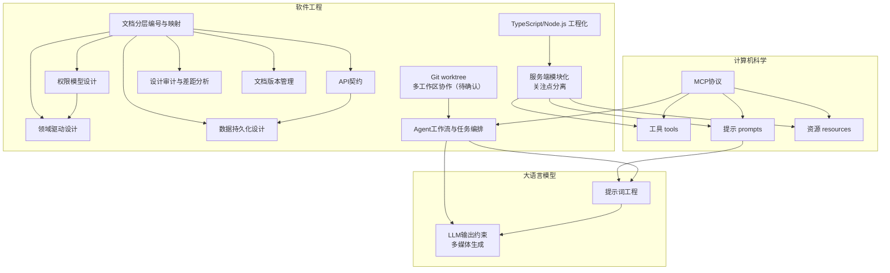

# 2026-05-23 概念与知识关系提炼

**日期**：2026-05-23

**输入文件列表**：
- `prework/2026-05/2026-05-23/work_summary_AInote.md`
- `prework/2026-05/2026-05-23/work_summary_DailyLearningAssistant.md`
- `prework/2026-05/2026-05-23/work_summary_interview_prepare.md`
- `prework/2026-05/2026-05-23/work_summary_mcp.md`
- `prework/2026-05/2026-05-23/work_summary_ResearchPaperBase_cc.md`
- `prework/2026-05/2026-05-23/work_summary_ResearchPaperBase_codex.md`

---

## 当日核心主题总览

这一天的工作线索主要来自两个发生实质性变更的仓库——`mcp` 与 `ResearchPaperBase_codex`，以及 `DailyLearningAssistant` 的一个已确认提交。整体呈现出三类相互关联的技术关注点：

- **协议与架构落位**：`mcp` 仓库完成了一个基于 TypeScript 的 MCP 服务端初始化架构，显式划分了工具（tools）、提示（prompts）、资源（resources）三个能力模块。
- **设计文档体系化与权限模型**：`ResearchPaperBase_codex` 进行了两轮设计文档的重组，引入了分层编号与文件映射，并结合项目（Project）权限模型更新领域与需求文档。
- **Agent 工作流与提示词约束**：`DailyLearningAssistant` 出现一个明确提交，涉及提示词（prompt）文件的修改、Agent 配置更新以及多媒体输出（PPT）生成脚本的调整，且存在大量未确认的本地变更，提示整个学习助手管线正在向 MCP 方向对齐并持续迭代。

其余三个仓库（AInote、interview_prepare、ResearchPaperBase_cc）在检查窗口内无新增技术线索。

---

## 概念清单

根据当日材料，可确认（或待确认）以下概念：

1. **MCP（Model Context Protocol）** - 一种为大语言模型提供外部上下文（工具、资源、提示）的协议。
2. **工具（tools）** - MCP 中封装特定操作的执行单元，供模型调用以完成任务。
3. **提示（prompts）** - MCP 中预定义好的提示模板或指令，用于引导模型行为。
4. **资源（resources）** - MCP 中可供模型读取的静态或动态数据源。
5. **服务端模块化与关注点分离** - 将服务端功能拆分为独立模块（如 server、tools、prompts、resources）以降低耦合的设计思想。
6. **TypeScript/Node.js 工程化** - 通过 TypeScript 类型系统、包管理（npm）等组织代码的方式。
7. **文档分层编号与映射** - 用 `00_layers.md` 和 `00-00_layer_design_file_mapping.md` 等文件维护设计文档之间的层级关系，保证文档体系的内聚性。
8. **领域驱动设计（DDD）** - 通过显式定义领域模型和核心概念来驱动系统设计的建模方法。
9. **权限模型设计** - 围绕“项目（Project）”定义访问控制规则，刻画系统安全边界。
10. **API 契约** - 以独立文档预先规定接口请求/响应结构，作为前后端或服务间的约定。
11. **数据持久化设计** - 提前规划数据存储方案，包括数据需求文档和对应的 SQL 模式定义。
12. **设计审计与差距分析** - 对已有设计进行审视，识别缺陷与未覆盖部分，并记录决策与改进。
13. **文档版本管理** - 通过备份（backup）保留历史版本，而不是直接覆盖，以实现设计演进的追溯。
14. **提示词工程** - 通过精心设计 prompt 模板或文本，让 LLM 产生预期的输出模式（关联 `prompt/` 目录的修改）。
15. **Agent 工作流与任务编排** - 多个 Agent 协作或顺序执行以完成复杂任务（关联 `AGENTS.md` 及 `orchestrator/run_daily.py` 的改动）。
16. **LLM 输出约束与多媒体生成** - 让 LLM 的输出符合特定格式（如 PPT 的二进制结构），从而生成可直接使用的文件。
17. **Git worktree 与多工作区协作**（待确认变化线索） - 利用 Git worktree 管理多个并行工作区，支持不同任务流的同时进行。

---

## 分领域线索

### 数学
未发现明确线索。

### 物理
未发现明确线索。

### 计算机科学

- **MCP（Model Context Protocol）** 被显式实现，作为连接 LLM 与外部能力（工具/资源/提示）的协议，本质上是人机交互体系向“模型-协议-环境”架构的延伸。
- **工具、提示、资源的协议化定义**：MCP 将原本散落在 prompt 工程里的工具调用、系统提示、知识检索等需求抽象为三类标准化的通信原语，这是计算机科学中“协议分层”和“能力抽象”思想的典型体现。

以上概念来源于 `mcp` 仓库的初始化提交，虽未深入代码细节，但文件结构和模块名称已经清晰地标定了这些原语的定位。

### 软件工程

软件工程领域线索最为丰富，可细分如下：

**架构与设计方法**
- **服务端模块化与关注点分离**：`src/server.ts`、`src/tools/*`、`src/prompts/*`、`src/resources/*` 的目录结构是这一思想的直接映射（来自 `mcp`）。
- **文档分层编号与映射**：`ResearchPaperBase_codex` 中新增的 `00-00_layer_design_file_mapping.md` 与 `00_layers.md` 形成一套显式的文档组织契约，其背后的思想是“用元文档维护设计体系的内聚性”，避免随着文档增多而出现的碎片化。
- **领域驱动设计（DDD）**：`02_domain_core.md` 的存在表明设计团队有意将领域模型提升为独立关注点，与功能需求、API 契约等解耦。
- **权限模型设计**：将“项目（Project）”作为权限的承载单位，显式建模访问规则，这属于安全工程与领域建模的交叉地带。
- **API 契约与数据持久化**：通过 `04_api_contracts.md` 和 `07_data_schema.sql` 等文件提前锁定接口与数据结构，体现了“契约先于实现”的设计哲学。

**版本管理与演进**
- **设计审计与差距分析**：删除 `11_design_audit.md` 并新增 `12_gap_decisions_review.md`，暗示对设计审查流程的改进——从静态审计转向持续差距分析与决策记录的结合。
- **文档版本管理**：将旧文件移入 `backup/` 而不直接删除，保留了设计演进的可逆路径，这是配置管理在文档资产上的应用。

**工程化与自动化**
- **TypeScript/Node.js 工程化**：`mcp` 项目通过 `tsconfig.json`、`package.json`、`package-lock.json` 建立了类型安全、依赖锁定的代码基座。
- **Agent 工作流与任务编排**：`DailyLearningAssistant` 的提交涉及 `AGENTS.md`（很可能是多 Agent 的配置描述）和 `orchestrator/run_daily.py`（流程编排入口），体现了用 Agent 模式组织自动化管线的工程取向。
- **Git worktree 与多工作区协作**（待确认变化线索）：`DailyLearningAssistant` 的 worktree 当前存在待确认变更，这种工作方式在多任务并行开发中常见，反映了协作与隔离的工程实践。

### 大语言模型

- **提示词工程**：`DailyLearningAssistant` 提交修改了 `prompt/01_daily_work_summary.md` 和 `prompt/02_concept_relevance.md`，说明整个系统的输出质量在持续通过提示模板调优，这是一种面向 LLM 的“程序设计”。
- **LLM 输出约束与多媒体生成**：`generate_ppt.py` 修改与 `.pptx` 文件更新表明系统需要让 LLM 的生成结果满足二进制 Office 格式的严格要求，这涉及把非结构化的文本生成结果结构化、格式化，本质上是对 LLM 输出进行“证据约束”和形态转化。
- **MCP 与 LLM 的集成**：`mcp` 仓库的初始化虽然未直接涉及 LLM 调用，但它构建了模型与外部工具/资源/提示之间的标准接口，可以看作是 LLM 应用架构中“能力供给层”的实现，为后续 LLM 驱动的工作流提供了基础设施。

---

## 跨领域关联图

（注：图中用箭头表示概念之间的影响、支撑或包含关系；`Git worktree` 因属于待确认线索，以虚线标示。）

---

## 概念关联图谱

| 概念 A | 概念 B | 关系类型 | 简要说明 |
|--------|--------|----------|----------|
| MCP 协议 | 工具/提示/资源 | 协议定义 | MCP 将工具、提示、资源标准化为协议中的三类能力原语 |
| 工具/提示/资源 | 服务端模块化与关注点分离 | 设计体现 | `mcp` 项目按这三类能力拆分代码模块，实现关注点分离 |
| 提示（prompts） | 提示词工程 | 概念映射 | MCP 中的 “prompt” 是提示词工程在协议层的具象化 |
| 提示词工程 | LLM 输出约束与多媒体生成 | 方法-目标 | 通过定制 prompt 让 LLM 生成符合 PPT 格式约束的输出 |
| Agent 工作流与任务编排 | 提示词工程 | 协作关系 | 编排中的多个 Agent 依赖不同的 prompt 模板来执行子任务 |
| Agent 工作流与任务编排 | LLM 输出约束与多媒体生成 | 流程-结果 | 整个编排流程的最终产物可能包括学习报告、PPT 等，依赖输出约束 |
| 文档分层编号与映射 | 领域驱动设计 | 结构化支持 | 分层映射文件为领域模型文档提供了清晰的定位和引用路径 |
| 文档分层编号与映射 | 权限模型设计 | 结构化支持 | 权限相关设计文档被归入统一分层，便于查找与一致性维护 |
| 文档分层编号与映射 | API 契约 | 结构化支持 | API 契约文档按层编号，保持与整体架构的对应关系 |
| 文档分层编号与映射 | 设计审计与差距分析 | 方法-对象 | 分层体系使审计可以聚焦于某一层，差距分析更有针对性 |
| 文档分层编号与映射 | 文档版本管理 | 互补关系 | 分层维护的是结构化骨架，备份保留的是时间维度的快照 |
| 领域驱动设计 | 权限模型设计 | 支撑关系 | 权限模型中的“项目”是领域核心概念，领域驱动设计为其提供了建模方法 |
| API 契约 | 数据持久化设计 | 上下游 | API 定义的资源形态直接影响数据 schema 的设计 |
| Git worktree（待确认） | Agent 工作流与任务编排 | 基础设施 | 如果 worktree 用于并行处理多个日常任务，则它是编排管线的协作基础 |

---

## 详细关联描述

今天的材料中最突出的线索是 **MCP 协议的工程落地** 与 **设计文档的体系化**，它们共同揭示了一种从“零散脚本”走向“可治理系统”的努力。

**1. MCP 作为胶水：连接 LLM 调用与软件工程纪律**
`mcp` 仓库的初始化提交完成了一个典型的 TypeScript 服务端骨架，最关键的是它严格按照 MCP 的三大组件——工具、提示、资源——来划分模块。这不仅仅是代码组织问题，更是把 LLM 应用开发中频繁出现的工具调用、系统提示模板、知识资源访问等行为抽象为可配置的协议端点。这种规范化使得 **提示词工程** 不再是一次性的文本拼凑，而变成可通过协议重用和版本化的资产。同时，`DailyLearningAssistant` 中关于 prompt 文件的修改、PPT 生成脚本的调整，也可以看到的趋势：系统正试图通过 MCP 这类协议，将 LLM 的输出约束和自动生成能力纳入一个可扩展的服务端架构中。

**2. 设计文档的分层治理：从“写文档”到“维护系统设计的一致性”**
`ResearchPaperBase_codex` 的两轮提交清晰地展示了一次设计文档的“架构手术”。通过引入 `00-00_layer_design_file_mapping.md` 和重写 `00_layers.md`，团队建立了一套明确的文档编排规则——这本身是软件工程中的“元模型”。一旦分层编号体系成型，**领域驱动设计** 中的聚合、实体等概念就能在 `02_domain_core.md` 中得到独立而清晰的表达；**权限模型** 中关于 Project 的访问控制规则也能在 `08_security_permissions.md` 里精确锚定；**API 契约** 与 **数据持久化设计** 则可以沿着同一套分层标准对齐。而且，旧文件没有被粗暴删除，而是移入 `backup/` 目录，这体现了对 **设计演进可逆性** 的重视——哪怕是一次文档重组，也保留了配置管理的痕迹。

**3. Agent 管线中的提示词与输出约束**
`DailyLearningAssistant` 唯一确认的提交名为 “Update new tracing to mcp project”，说明整个学习助手项目正在向 MCP 生态靠拢。该提交修改了 `prompt/` 下的提示词文件，这些提示词是整个 Agent 流程的“控制指令”；而 `generate_ppt.py` 和 `.pptx` 文件的更新，则是 LLM 输出需要被严格塑形的例子。从概念上看，这里存在一条清晰的链路：**Agent 工作流与任务编排** → 调用经过 **提示词工程** 优化的指令 → 约束 LLM 生成符合特定格式（如 PPT）的 **多媒体输出**。与此同时，仓库中大量的未提交变更（包括 `orchestrator/run_daily.py` 和多个 work_summary 文件的修改）以及 worktree 中待确认的变化线索，暗示这套管线正在经历密集的迭代，很可能在引入 MCP 之后调整了每日工作的分割方式和输出规范。

**4. 交织而成的知识网络**
上述三条支线并非独立：`mcp` 提供的工具/提示/资源原语，完全可能成为 `DailyLearningAssistant` 中 Agent 调用外部知识（如文献库、面试题）时的标准接口；而 `ResearchPaperBase_codex` 里严格分层的设计文档，则可以成为未来 MCP 资源模块中的结构化知识源。这也解释了为什么同一个作者在同一天同时触及这三个仓库——本质上是在为“LLM 驱动的学习与研究助手”搭建从协议、到工程管线、再到知识结构化的完整链条。

---

## 可供后续知识讲解使用的概念候选摘要

以下候选概念均直接从当日变更材料中提取，并附有简要的支撑依据，但不包含任何教学计划或讲解顺序。

| 候选概念 | 依据（从哪个仓库的哪部分材料得出） |
|----------|----------------------------------------|
| **MCP 协议的原语抽象**（工具、提示、资源） | `mcp` 仓库 `src/tools/`、`src/prompts/`、`src/resources/` 的模块划分 |
| **服务端关注点分离与模块化** | `mcp` 仓库独立的 `server.ts` 及三大能力模块 |
| **设计文档的元层次管理**（分层编号与映射文件） | `ResearchPaperBase_codex` 新增 `00-00_layer_design_file_mapping.md` 并修改 `00_layers.md` |
| **领域驱动设计中的核心域显式定义** | `ResearchPaperBase_codex` 新增 `02_domain_core.md` |
| **基于资源的权限建模**（Project 权限模型） | `ResearchPaperBase_codex` 提交 “Update design docs with Project permission model” |
| **契约先行的接口设计** | `ResearchPaperBase_codex` 中 `04_api_contracts.md` 的存在 |
| **设计审计与持续差距分析** | `ResearchPaperBase_codex` 中 `11_design_audit.md` 被删除，`12_gap_decisions_review.md` 被新增 |
| **文档作为资产的可逆演进**（备份而非覆盖） | `ResearchPaperBase_codex` 中旧文件移入 `backup/` 目录 |
| **提示词工程作为 LLM 控制通道** | `DailyLearningAssistant` 提交修改 `prompt/01_daily_work_summary.md`、`prompt/02_concept_relevance.md` |
| **LLM 输出的结构约束与多媒体生成** | `DailyLearningAssistant` 提交修改 `generate_ppt.py` 和 `.pptx` 文件 |
| **Agent 工作流与编排的配置驱动** | `DailyLearningAssistant` 提交修改 `AGENTS.md` 和 `orchestrator/run_daily.py` |
| **Git worktree 的多任务并行模式**（待确认） | `DailyLearningAssistant` 存在 worktree 待确认变化线索，涉及多个文件修改 |

（注：若后续确认 worktree 变更的时间归属，则该候选概念可升级为正式线索；目前需保留“待确认”标注。）

---

*以上提炼严格基于 `prework/2026-05/2026-05-23` 目录下六个仓库的工作总结内容完成，未引用其他日期或外部资料。*
